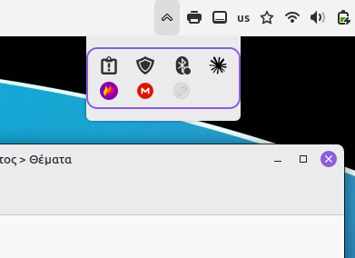
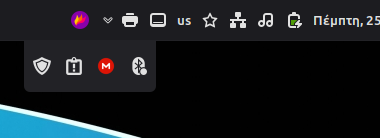
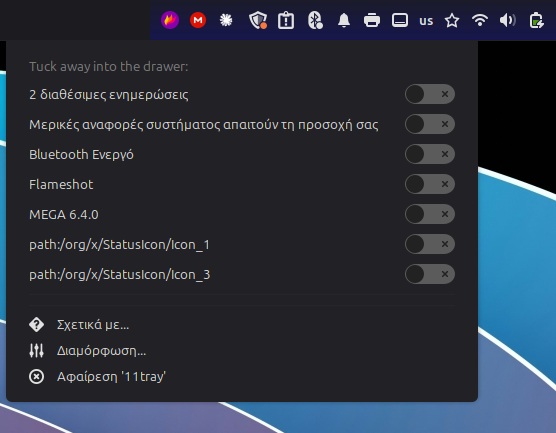

# 11tray — Windows 11-style tray overflow for Cinnamon

A system tray that hosts your app status icons and lets you tuck the ones you
don't want to see behind a small arrow — a drawer, like Windows 11. The choice
is per-app and remembered, so the tray stays tidy as you install more apps. On a
fresh install every icon starts tucked away, and you pick which ones to show.



11tray **replaces** the stock XApp status applet and renders the icons itself, so
it can split them into a visible strip and a hidden drawer.

## What it does

- **Hidden by default.** On a fresh install every icon sits in the drawer behind
  the arrow; you bring out only the ones you want on the panel. New apps you
  install also start hidden, so the panel never clutters up on its own.
- **Per-app, remembered.** Your show/hide choices are keyed to the app, so they
  survive reloads and reboots.
- **System icons grouped.** Update manager, Bluetooth, system reports and the
  like are detected and kept together, next to the panel's other system
  indicators. Your app icons sit on the other side.
- **Size follows the panel.** Icon size is taken from the settings (defaults to
  match the panel's system icons) and is adjustable.
- **Theme-aware arrow**, reusing grun's pointer assets.

## The drawer

Right after install everything is tucked away and the arrow opens the drawer —
here with a couple of icons already brought out onto the panel:


Collapsed, the panel shows just what you chose, plus the arrow:


It's theme-aware — the arrow and icons follow your light/dark theme:



## Choosing what shows

Everything starts in the drawer. The quickest way to rearrange:

- **Ctrl+click any icon to move it between the panel and the drawer.** Ctrl+click
  one on the panel to tuck it away; open the drawer and Ctrl+click one there to
  bring it out. That's the whole workflow — no menus.

Or, for a checklist view:

- **Right-click the applet** for a per-icon switch list (switch *off* = shown on
  the panel). While the arrow is present you have a spot to right-click; if you've
  brought everything out and the arrow is gone, turn on **Panel edit mode**
  (right-click the panel → Troubleshoot → Panel edit mode) to get one, then turn
  it off when done.

**Left-click works in the drawer** — it activates the app and the drawer stays
open. **Right-click does not show the app's own menu while it's in the drawer.**
That's an Xorg trade-off: to be clickable on top of other windows the drawer
needs a pointer grab, and that same grab stops the app's right-click menu from
appearing (the menu needs the grab itself). So a right-click in the drawer just
closes it. To use an icon's right-click menu, bring it onto the panel first
(Ctrl+click) — on the panel there's no grab and the app's menu works normally.



## Install

```bash
./install.sh          # copy into ~/.local/share/cinnamon/applets/
./install.sh --link   # symlink instead (for development)
./install.sh --zip    # build 11tray@kalotrapezis.zip for the Cinnamon Spices
```

Then right-click the panel → **Applets**, add **11tray**, and **remove the stock
"XApp Status Applet"** so icons don't appear twice. If it doesn't show up, reload
Cinnamon (Alt+F2 → `r` → Enter).

> 11tray currently hosts **XApp status icons** (the modern kind most apps use).
> Legacy XEmbed tray icons are still served by the stock `systray` applet — leave
> that one in place for now.

## Settings

Open the applet's settings (the gear in the Applets list) to set the **tray icon
size** and the **icons per row** in the drawer. The hide/show list is in the
right-click menu (see above), since it has to reflect your live icons.

## Status

Working today: hosting and rendering icons, the grid drawer with a theme-accent
border, per-app persistence, system grouping, per-app exceptions, and
configurable size/row width. **Drag-and-drop** to move icons between the strip
and the drawer is the next planned step — for now use Ctrl+click or the
right-click switches. See [plan.md](plan.md) for the roadmap and
[CHANGELOG.md](11tray@kalotrapezis/CHANGELOG.md) for release history.

## Requirements

- Cinnamon 6.0+ (developed on 6.6, X11).

## License

[GNU AGPL-3.0](../Mint-runner/LICENSE).
