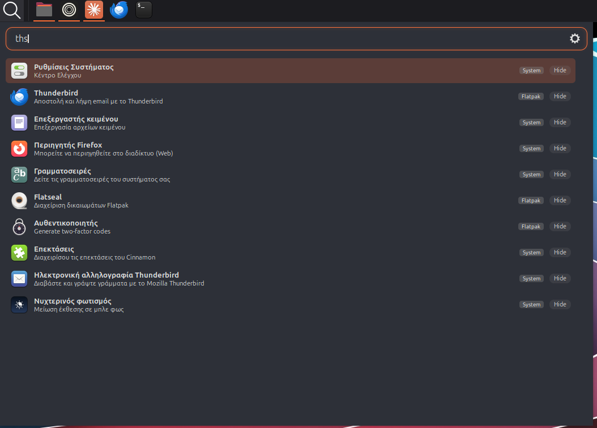
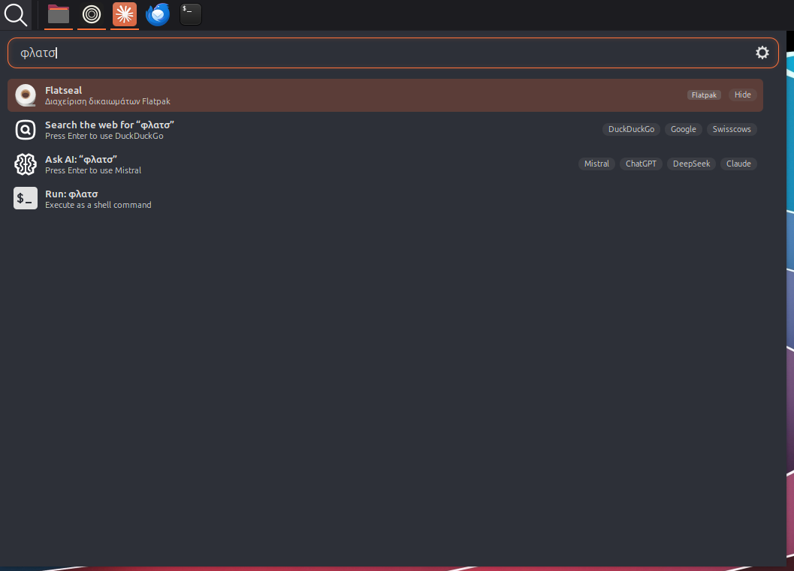

# grun — Cinnamon applet

A keyboard-driven launcher that lives in the panel: apps, calculator, web/AI
search, files, clipboard and power — with layout-independent, typo-tolerant
fuzzy matching.


## Why a popup (and why it has no flicker)

The standalone grun is a GTK4/X11 window. On X11 the window manager places the
window, and any attempt to reposition it after it maps causes the open-time
flicker — there is no clean fix while it's a separate window.

This applet draws its UI as a **Cinnamon popup** — a Clutter/St actor owned by
the compositor. There is no separate top-level window, so there is nothing to
position and **nothing to flicker**. It opens instantly, anchored to the panel.

## Features

- **Home dashboard** — a start-menu grid of your clipboard history, most-used
  apps and recent files, each with inline actions (pin, hide, copy path, open
  folder…). Sections expand/collapse.
- **Apps** — fuzzy search of installed apps with a System/Flatpak/Snap/AppImage
  tag, launched on Enter.
- **Layout-independent + typo-tolerant matching** — type in any keyboard layout
  (`βοττλεσ` finds *Bottles*), and `thunderbrid` still finds Thunderbird.
- **Calculator** — `12 * (3 + 4)` → Enter copies the result.
- **Web search** — Google / DuckDuckGo / Swisscows (pick the default order).
- **AI chat** — Claude / ChatGPT / DeepSeek / Mistral (pick the default order).
- **System power** — `shutdown`, `restart`, `sleep`, `hibernate`, `lock`,
  `log out` via systemd.
- **Files** — fuzzy filename search across your home folder.
- **Run command** — optional; runs what you type as a shell command.
- **Clipboard manager** — recent text/image clips, pinnable, in the home grid.
- **Stable, fixed-size popup** — the window keeps one size for both the home
  dashboard and search results, so it never grows or shrinks while you type.
- **Theme-aware** — picks up the active GTK theme's accent colour and a
  dark/light icon set automatically.

It shares state with the standalone grun: it reads and writes the same
`~/.config/grun/config` and `~/.local/share/grun/history.json`.

## Layout-independent search

You don't have to switch keyboard layout to find anything. grun maps Greek ↔
Latin keys and ignores accents, so the query matches regardless of which layout
you're typing in or which language an app's name is in.

Type Latin `ths` and the Greek-labelled apps still match (Thunderbird, Firefox,
Flatseal…):



…and type Greek `φλατσ` to find the Latin-named **Flatseal**:



## Keyboard

| Key | Action |
| --- | --- |
| Global shortcut (default **Ctrl+Alt+A**) | Open / close |
| Type | Search |
| ↑ / ↓ / Tab | Move selection |
| Enter | Run the selected item |
| Esc | Clear the query, then close |
| Tab / arrows (on home) | Jump into the card grid; letter keys select a card |

## Install

```bash
./install.sh          # copy into ~/.local/share/cinnamon/applets/
./install.sh --link   # symlink instead (for development)
./install.sh --zip    # build grun@kalotrapezis.zip for the Spices
```

Then right-click the panel → **Applets**, select **grun**, and add it. If it
doesn't appear, reload Cinnamon (Alt+F2 → `r` → Enter). Configure the shortcut
and the result limit from the applet's right-click menu → **Configure**; the
functions, web/AI order and home dashboard are configured from the ⚙ button
inside the popup.

## Requirements

- Cinnamon 6.0+ (developed on 6.6, X11).

See [CHANGELOG.md](CHANGELOG.md) for release history.
