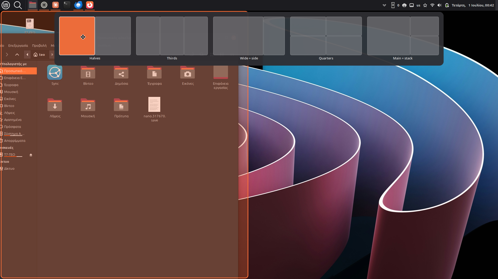
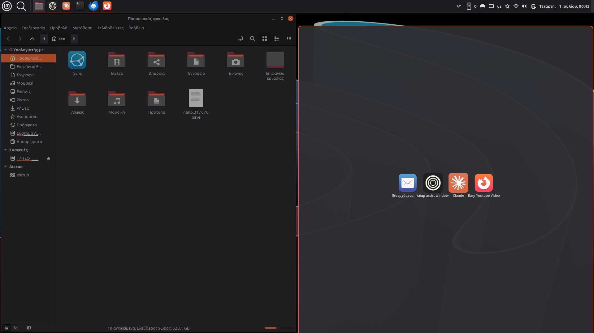

# Mint-essentials

My own Cinnamon (Linux Mint) applets, built with Claude. Each applet lives in
its own self-contained folder and can be installed independently.

## Applets

### [grun](Mint-runner/) — keyboard-driven launcher

A panel launcher for apps, calculator, web/AI search, files, clipboard and
power, with layout-independent fuzzy matching. Its UI is a Cinnamon popup, so
there is no separate window and no open-time flicker.


See the [grun README](Mint-runner/README.md).

### [11tray](11tray/) — Windows 11-style tray overflow

A system tray that tucks the app status icons you don't want behind a small
arrow, in a drawer. Everything starts hidden and you pick what shows; the choice
is per-app and remembered, so the tray stays tidy as you install more apps.
System icons (update manager, Bluetooth…) are grouped together automatically.


See the [11tray README](11tray/README.md).

### [11snap](11snap/) — Windows 11-style snap layouts

Drag a window to the top of the screen and a picker of layout templates appears;
drop it on a zone and the window snaps there, with a live preview of where it
will land. Then Snap Assist offers to fill the empty zones from your open
windows. Includes a visual editor (Ctrl+Alt+~) for building your own layouts.
Unlike the applets above this is a small background app, not a panel applet.





See the [11snap README](11snap/README.md).

## Install

The **applets** (grun, 11tray) ship an `install.sh` in their folder:

```bash
./install.sh          # copy into ~/.local/share/cinnamon/applets/
./install.sh --link   # symlink instead (for development)
./install.sh --zip    # build a .zip for the Cinnamon Spices
```

Then right-click the panel → **Applets**, select the applet, and add it. If it
doesn't appear, reload Cinnamon (Alt+F2 → `r` → Enter).

**11snap** is a background app, so its `./install.sh` instead drops a binary in
`~/.local/bin`, enables autostart and binds the editor hotkey.

## Requirements

- Cinnamon 6.0+ (developed on 6.6, X11).

## License

[GNU AGPL-3.0](Mint-runner/LICENSE).
